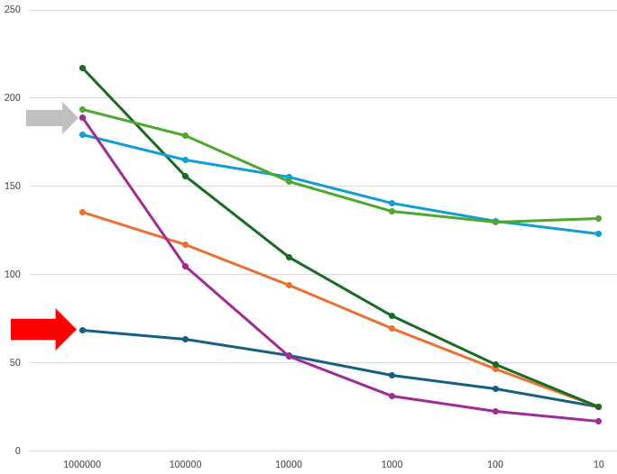

# quicksort-go

I'm learning Go, and implementing Hoare's Quicksort in Go seemed like a good exercise.

Go markets itself as easy to learn and great for building simple systems. Having previously implemented Hoare's Quicksort in Java - see https://github.com/jamie-burns0/quicksort - I found Go lived up to it's hype for this project.

There's not much between the two implementations, but, for me, I prefer the Go implementation. The Go implementation is concise and easier to follow. I have a useful Go unit test suite. (I avoided creating a unit test suite in the Java implementation)

### Optimisation investigation

A feature of Go is its concurrency support. Hoare's Quicksort divide-and-conquer approach seemed like a good opportunity to both explore Go's concurrency and see if concurrency would improve performance of the sort.

In the `partition` method, we have pointers at either end of a segment that converge on a pivot value. When `partition` is done we should know the index of our pivot value and every value less than our pivot value will be left of the index and every value greater on the right.

#### 1M ints

For testing, I settled on a slice of int with capacity 1,000,000 and populated this with random ints. In test cases, the range of random ints varied from 0-1000000, 0-100000,...,0-10. For the first set, the likelyhood of repeating or ordered values was going to be low, through to the last set, where the likelyhood of repeating or ordered values was going to be high.

#### Idea one

What would happen if the for-loops where we move the converging pointers were in goroutines? It seemed like a good idea, but using goroutines here __increased__ execution by x100.

#### Idea two

Could `partition` be executed in a goroutine? This was an improvement, but this strategy still __increased__ execution time by x5.

#### Event driven architecture

Goroutines and channels behave in an EDA way. A producer goroutine writes some data to a channel which is read by a consumer goroutine which writes some data to a channel, and so on. In our case,


#### Deadlocks

This was all going well until,

> __fatal error: all goroutines are asleep - deadlock!__

Deadlocks! What a pain. This blocked me for a while. Nothing I tried would fix this issue.

I took a break and went back to watching Matt Holiday's Go Class. In [26 Channels in Detail](https://youtu.be/fCkxKGd6CVQ?t=540&si=y1aHUn_Gna--r9zZ), Matt explains the difference and use of unbuffered and buffered channels. In my case, I was using unbuffered channels and as more segments were put onto the Segment channel - partitioning one segment usually created two segments - eventually a sender and receiver got into a deadlock.

> [!IMPORTANT]
> The goroutine that writes to a non-buffered channel, will __always block until__ the goroutine that reads the non-buffered channel has read the value from the channel.

#### Buffered channel size

Changing all my non-buffered channels to buffered channels fixed my deadlock issue - for a short time. I soon hit deadlocks again.

This time the issue was the capacity of my buffered channels.

Through trial and error, I found my deadlocks went away when I set the capacity of my buffered channels to 5% of the number of items being sorted.

```
	buffer := int(len(list)/20) + 1
	segChan := make(chan segment, buffer)
	...
```

For most tests, I was sorting 1M items and have tested up to 100M items. So far, I haven't had anymore deadlocks. I would need a math buddy to explain why 5% works or if another percentage is better than 5%.

#### Done

An interesting problem in the asynchronous quicksort was how to signal we are done sorting the data.

To solve this, a done channel was created. When a segment was guaranteed to be in order, the segment was put on the done channel. In `AsyncSort`, we start with the number of elements to be sorted, then read the done channel in an infinite for-loop and subtract the size of each segment from the remaining elements. When `remaining` is zero, we are done and break out of the for-loop.

```
    remaining := len(list)
	for {
		doneSeg := <-doneChan
		remaining -= (doneSeg.rightIndex - doneSeg.leftIndex + 1)
		if remaining == 0 {
			break
		}
	}
```

#### Order optimisation

I explored an optimisation around detecting when a segment being partitioned is in sorted order. As the likelyhood of ordered partitions increased this seemed an easy winner. It introduced a lot of complexity into partitioning, and mostly performed poorer than code that didn't look for ordered segments.

#### Partition goroutines

Of the three goroutines in our asynchronous quicksort, the partition goroutine does the most work. So in `AsyncSort2` and `AsyncSort2B`, we launch four partition goroutines.

I was surprised by the result. Running four partition goroutines on its own was not a winner. However, running four partition goroutines that included detecting if the segment was in order resulted in faster sorts than our iterative sort, `Sort`, in certain conditions.

As described earlier, I ran tests where we sorted 1M ints with random values from 0-1000000, 0-100000,...,0-10. For 1M ints where the likelyhood of ordered segments was low (0-1000000), running four partition goroutines with order optimisation was significantly slower than the original iterative quicksort. At the other end of the scale where the likelyhood of ordered segments was high (0-10), running four partition goroutines with order optimisation was about 25% faster than the original iterative quicksort.

In the graph below, the grey arrow points to the sort time when running four partition goroutines with order optimisation, `AsyncSort2`. The red arrow points to the sort time when running the original iterative quicksort, `Sort`. Y-axis is the sort time in milliseconds. X-axis is the range of random int values in the sort - 0-1000000, 0-100000,...,0-10. We are sorting 1M random ints.



`Sort` is very linear and consistently fastest or close second-best. Running `AsyncSort2` is significantly slower until our ints are in the range 0-10000. From there on it runs a bit faster than our iterative sort.

### Conclusion

The simple synchronous iterative quicksort, `Sort` was the best or close second-best performer in all scenarios. It scales well. The code is simple and easy to maintain.

The asynchronous order optimised quicksort with up to four partition goroutines, `AsyncSort2`, performed better as the likelyhood of ordered partitions increased. The code is more complicated. The buffered channel sizes need tuning to avoid deadlocks.

For me, the use case for the asynchronous quicksort would be where, (1) the data sets are known to contain tightly constrained or high likelyhood of repeating values __and__, (2) performance is really, really important.

For any other use case, I would choose to implement the simple synchronous iterative quicksort.

___
#### Source code
https://github.com/jamie-burns0/quicksort-go